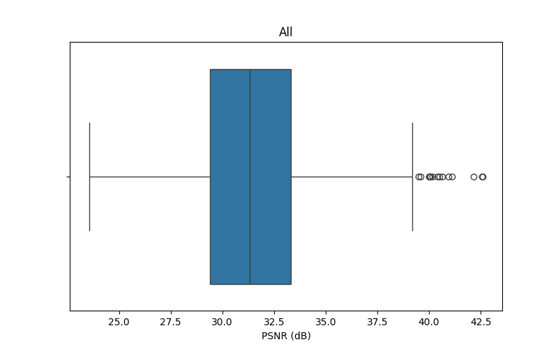
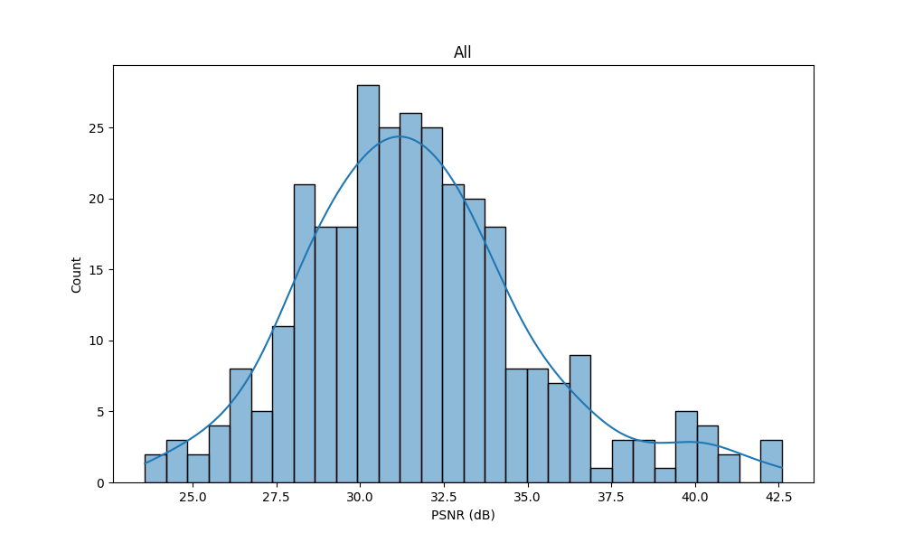
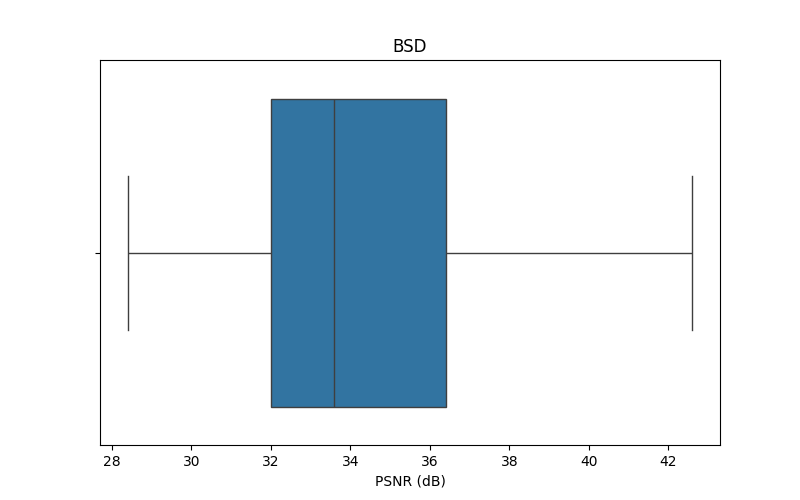
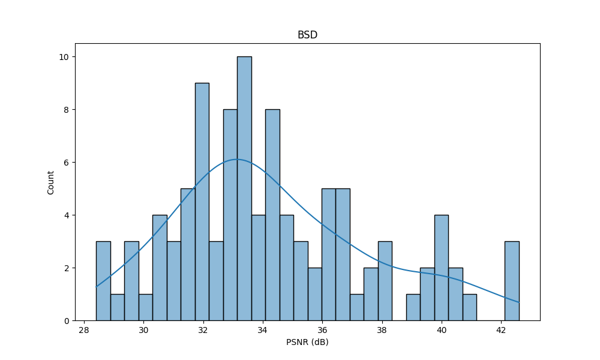
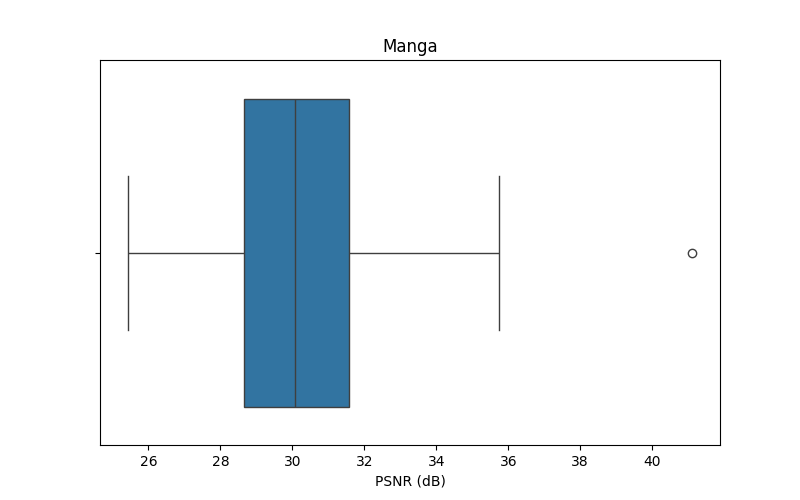
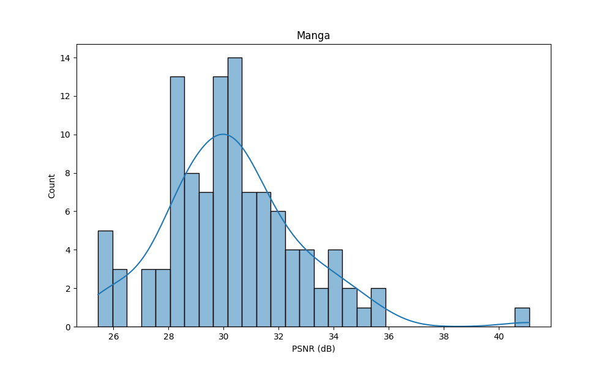
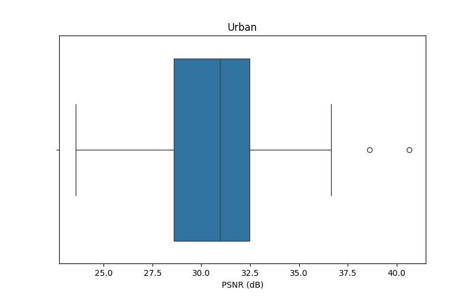
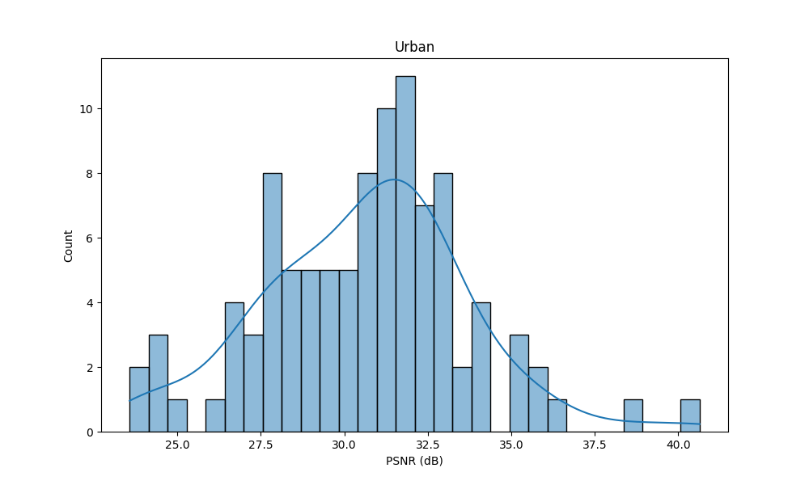

# SRCNN

模型代码参考

https://github.com/1990571096/SRCNN_Pytorch

## 使用步骤

1. 下载数据集到目录data
2. 把`test.sh`和`plot.py`移动到SRCNN_Pytorch/*
3. 修改一下`test.sh`中的参数
4. `sh test.sh`
5. `result`目录下是超分图片, `assets`目录下的是一些可视化数据展示

## 结果展示

